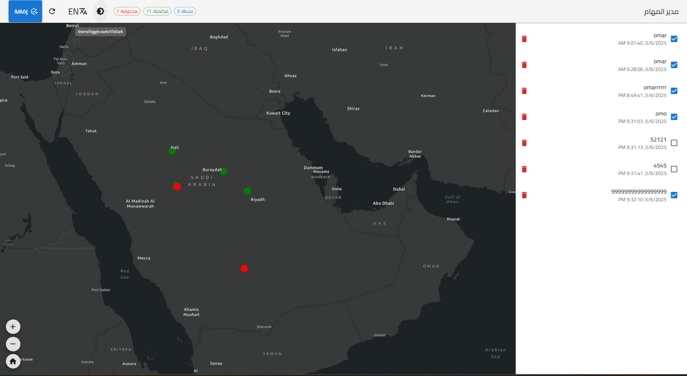

# 🌍 Todo Tasks with Map Location

A modern task management application with integrated Esri maps, featuring dark/light mode, multilingual support, and task analytics.


## ✨ Features

### 📝 Task Management
- Create, edit, and delete tasks
- Mark tasks as complete/incomplete
- View task statistics (completed/uncompleted/deleted counts)
- Location-based tasks with map integration

### 🗺️ Map Integration
- Interactive Esri ArcGIS maps
- Visualize task locations geographically
- Add location context to your tasks

### 🎨 UI/UX
- Dark/light mode toggle
- Responsive Material-UI design
- Right-to-left (RTL) language support
- Accessible components

### 🌐 Localization
- Multi-language support (English + Arabic included)
- Automatic language detection
- Easy to add new languages

## 🛠️ Technologies

- **Frontend**: React 19
- **Mapping**: Esri ArcGIS API (v4.32)
- **UI Components**: Material-UI (v7)
- **Localization**: i18next
- **Styling**: Emotion
- **State Management**: React Context

## 🚀 Getting Started

### Prerequisites
- Node.js (v16+ recommended)
- npm (v8+ recommended)
- Esri API key (free tier available)

### Installation
1. Clone the repository:
   ```bash
   git clone https://github.com/Omariu/TodoMap.git
   cd todo-map-app
